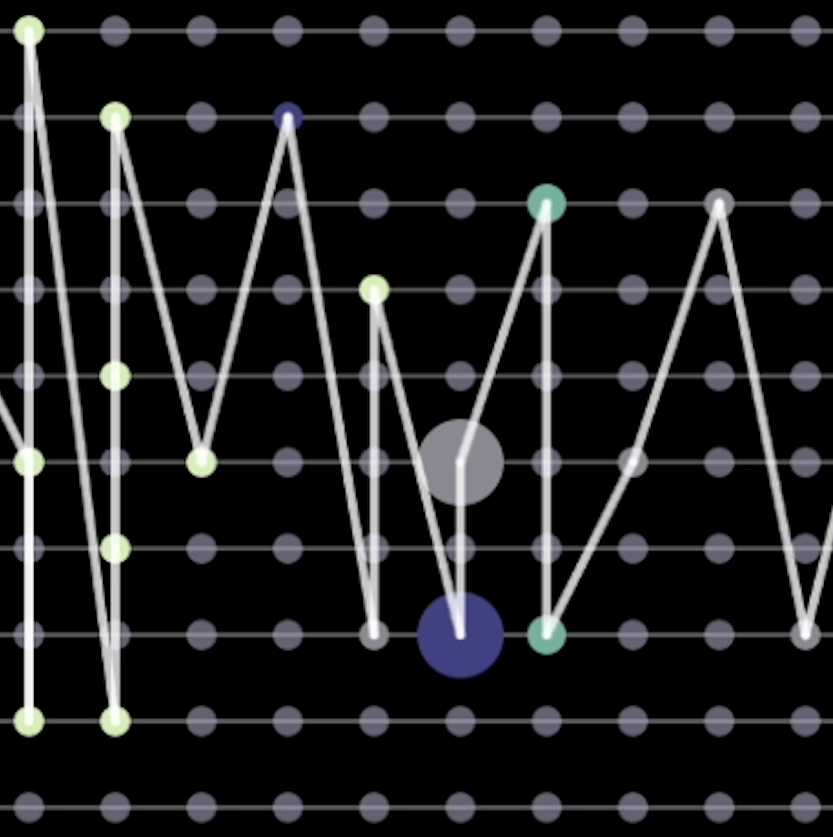
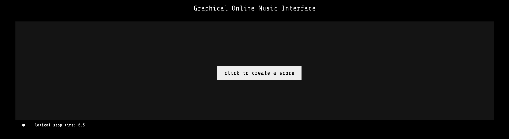
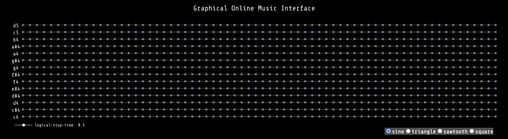
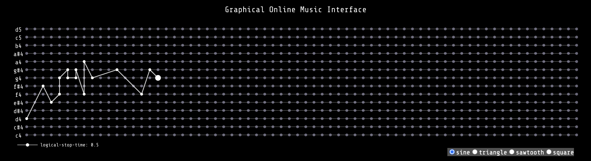
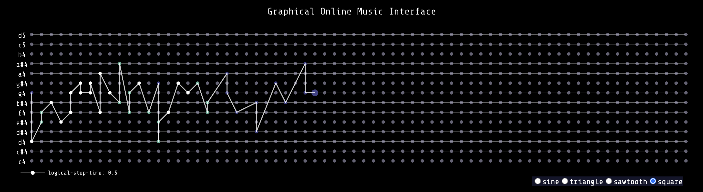
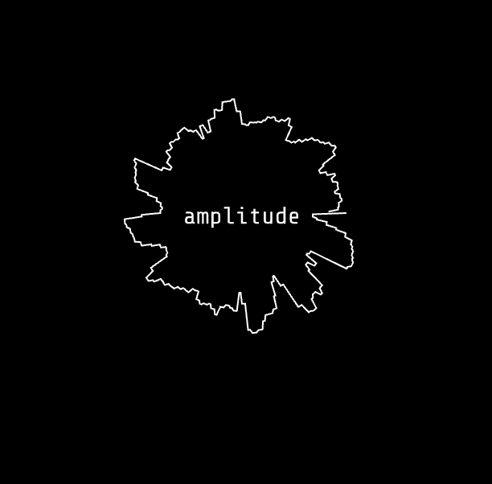
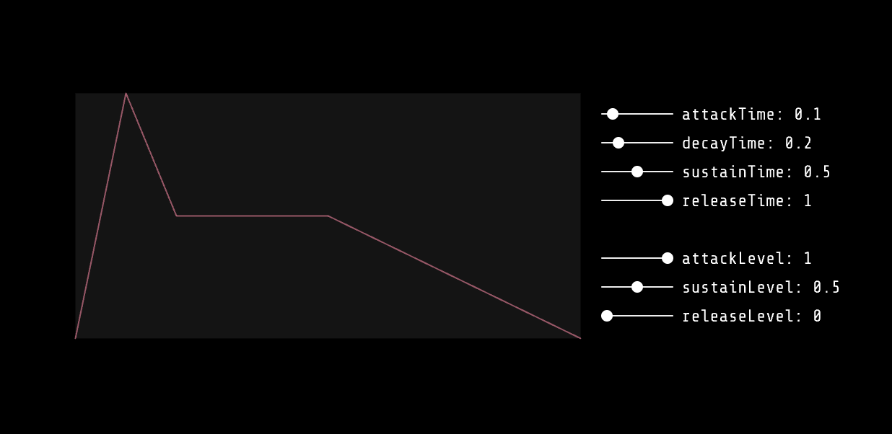
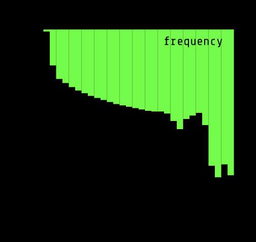
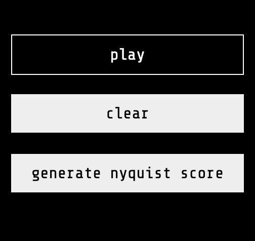

<p align="center">
  <a href="https://33v335.com/music/" rel="noopener">
 </a>
</p>

<h3 align="center">Graphical Online Music Interface</h3>

<div align="center">

[]()
[](https://github.com/zhixuanevelynwu/GOMI/issues)
[](https://github.com/zhixuanevelynwu/GOMI/pulls)
[](/LICENSE)

</div>

---

<p align="center"> An interactive composition tool
    <br> 
</p>

## 📝 Table of Contents

- [📝 Table of Contents](#-table-of-contents)
- [🧐 About ](#-about-)
- [🏁 How to Use ](#-how-to-use-)
  - [Canvas](#canvas)
  - [Graphs and Visualizations](#graphs-and-visualizations)
  - [Tools](#tools)
- [✍️ Author ](#️-author-)
- [🎉 Acknowledgements ](#-acknowledgements-)

## 🧐 About <a name = "about"></a>

The [Graphical Online Music Interface](https://33v335.com/music/) is a website that enables users to create music compositions through visual interactions. The goal of this project is to simplify the process of composing and adjusting computer music scores by visualizing sound synthesis parameters and providing real-time audible feedback. My motivation for starting this project was to enhance the user experience of computer music composition and make it more accessible for everyone.

## 🏁 How to Use <a name = "how-to-use"></a>
Here is a short [video](https://drive.google.com/file/d/1C2H45D9KcqhJANld2xrkzmR-PqM5Wae2/view?usp=sharing) demonstrating how to use the interface.

The following instructions will walk you through how to use and comprehend each part of GOMI.
  - First, follow this [link](https://33v335.com/music/) to access the interface.
  ### Canvas
  - The upper half of the page consists of a canvas. To start your composition, click on the "click to create a score" button. 
    <p align="center">
      
    </p>
  - After that, you will see a canvas which each dot represents a note in your score. The y-axis of the canvas denotes different pitches, while the x-axis of the canvas represents the start time of each note.
    <p align="center">
      
    </p>
  - Try clicking on one of the dots. You will hear immediate audio feedback of the selected note.
    <p align="center">
      
    </p>
  - You can switch between different type of waves you want to use in your sound synthesis. There are 4 options: sine, triangle, sawtooth, and square. Select one of them then click on the canvas, you will hear different results. 
  - Sounds produced from different waves are represented by different colors of dots on canvas. See below for an example. The sounds made from square wave are blue on the canvas, whereas sounds made from triangle waves are green, and sine waves are white.
    <p align="center">
      
    </p>
  - To erase a selected note, simply click on the note again. It will disappear, and the graph is rearranged for you.
  
  ### Graphs and Visualizations
  - On the bottom left corner, you will find a small circle representing the amplitude graph of your composition. Its shape changes as the loudness of your composition fluctuates. (I implemented this visualization following the [tutorial](https://www.youtube.com/watch?v=jEwAMgcCgOA&list=PLRqwX-V7Uu6aFcVjlDAkkGIixw70s7jpW&index=10&ab_channel=TheCodingTrain) made by The Coding Train)
    <p align="center">
      
    </p>
  - On the right of the amplitude graph, you can find a envelope graph. Try adjusting the slider next to the graph, you will hear slightly different sounds as you click on each note on the canvas. Check out this link if you want to know more about how [ADSR and envelopes](https://en.wikipedia.org/wiki/Envelope_(music)) work.
    <p align="center">
      
    </p>
  - On the bottom right corner you will find a green graph that changes as sounds are being played. This is a Fourier Transform visualization that represents the amplitude of each frequency that is currently being played.
    <p align="center">
      
    </p>
  
  ### Tools
  - After drawing your score, you can hear the ourcome by clicking on the "play" button on the bottom right corner of the page. Note that the notes are being played overtime. The first(leftmost) column of the dots on the canvas represents time 0, and so on. If you want to hear the outcome sound immediately, you may want to start your composition from the first column. The current note that is being played will slowly expand and shrink.
  - You can clear the entire canvas by clicking on the "clear" button.
    <p align="center">
      
    </p>
  - You can click on the third button to generate a score in [Nyquist](https://www.cs.cmu.edu/~rbd/doc/nyquist/) format. It will download a score.txt file on your computer in the below form, which you can easily copy and paste into the Nyquist IDE and play it using the instruments you defined.
    ```
      {
      {0.00 0.36 {sine-instr pitch: 68}} 
      {0.00 0.36 {sine-instr pitch: 60}} 
      {0.36 0.36 {sine-instr pitch: 66}} 
      {0.36 0.36 {sine-instr pitch: 64}} 
      {0.72 0.36 {triangle-instr pitch: 70}} 
      {1.08 0.36 {sine-instr pitch: 68}} 
      {1.08 0.36 {sine-instr pitch: 63}} 
      {1.80 0.36 {sine-instr pitch: 67}} 
      {2.16 0.36 {sine-instr pitch: 70}} 
      {2.16 0.36 {triangle-instr pitch: 63}} 
      {2.52 0.36 {sine-instr pitch: 66}} 
      {2.88 0.36 {sine-instr pitch: 67}} 
      {3.24 0.36 {sine-instr pitch: 69}} 
      }
## ✍️ Author <a name = "author"></a>

- [@zhixuanevelynwu](https://github.com/zhixuanevelynwu) - Idea & Initial work

## 🎉 Acknowledgements <a name = "acknowledgement"></a>

- Inspiration
  - https://musiclab.chromeexperiments.com/kandinsky/
  - https://xem.github.io/miniMusic/advanced.html
- References
  - https://www.youtube.com/watch?v=2O3nm0Nvbi4&ab_channel=TheCodingTrain
  - https://www.youtube.com/watch?v=Bk8rLzzSink&ab_channel=TheCodingTrain
  - https://www.youtube.com/watch?v=jEwAMgcCgOA&list=PLRqwX-V7Uu6aFcVjlDAkkGIixw70s7jpW&index=9&ab_channel=TheCodingTrain
